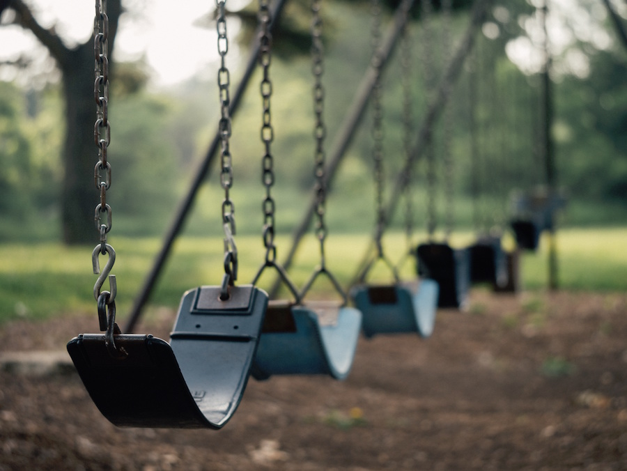

<!-- One -->
<section id="one" class="main special">
	

		
		

			<header class="major">
				<h2>What is a "non-proficient reader"?</h2>
			</header>
			
When literacy studies refer to "non-proficient readers", they're referring to readers that <b>range anywhere from illiterate to only having basic reading skills.</b> Some of these children can read words and sentence, however they:

                  
<ul>
                        <li>Don't comprehend what they read</li>
                        <li>Don't think critically about what they read</li>
                        <li>Rarely correct their own reading mistakes</li>
                        <li>Cannot summarize or ask critical questions about a text</li>
                        <li>See little to no purpose in reading</li>
                  </ul>

		

		<a href="#two" class="goto-next scrolly">Next</a>
	

</section>

<!-- Two -->
<section id="two" class="main special">
	

		
		

			<header class="major">
				<h2>The statistics show...</h2>
			</header>
			
Children entering kindergarten without basic literacy skills are <b> 3 to 4 times more likely to drop out.</b> Children who are still non-proficient by 3rd grade begin to <b>fall futher behind their peers each year</b> as reading is no longer explicitly taught & learning begins to depend on their ability to read independently. These children then become <b>4 times more likely to drop out.</b>

                  
The cycle of illiteracy continues in homes where low literacy adults are less likely to share reading with their children.

			<ul class="icons-grid">
				<li>
					<h2>88%</h2>
                              
of high school dropouts are non-proficient readers

				</li>
				<li>
					<h2>85%</h2>
                              
of juveniles in court system  are functionally illiterate

				</li>
				<li>
					<h2>67%</h2>
                              
of US 3rd graders are non-proficient readers

				</li>
				<li>
					<h2>43%</h2>
                              
of low literacy adults live in poverty

				</li>
			</ul>
		

		<a href="#three" class="goto-next scrolly">Next</a>
	

</section>

<!-- Three -->
<section id="three" class="main special">
	

		
		

			<header class="major">
				<h2>What can we do?</h2>
			</header>
			
First, we must understand that reading is not instinctive. Our brains must be taught extra steps to turn symbols into meaningful communication. <b>Reading must be fostered in children through modeling and guidance.</b>

                  
<a href="#strategies">Strategies</a> and <a href="resources">resources</a> for promoting literacy at home...

                  

                        
<h3>Strategies</h3>

                        
                        <h5>All ages</h5>
                              <ul>
                                    <li>Keep reading material around the house</li>
                                    <li>Let your child see you enjoy reading</li>
                                    <li>Write lists/notes together or to each other (e.g., grocery lists, reminders)</li>
                                    <li>Explore the library or bookstore together</li>
                                    <li>Model speech and storytelling (e.g., share family stories)</li>
                              </ul>
                        <h5>0 - 3 years old</h5>
                              <ul>
                                    <li>Talk to them. They may not understand yet, but the more words they hear, the greater their vocabulary and cognitive development will be</li>
                                    <li>Read to them <i>at least</i> 20 minutes per day</li>
                              </ul>
                        <h5>3 - 11 years old</h5>
                              <ul>
                                    <li>Incorporate reading into daily outings (e.g., read labels, menus, billboards, signs, anything that's functional/helpful)</li>
                                    <li>Read to them <i>at least</i> 20 minutes per day</li>
                              </ul>
                        <h5>12 years old and above</h5>
                              <ul>
                                    <li>Share and discuss books</li>
                                    <li>Ask them questions or have them retell you the stories they're reading in school</li>
                              </ul>
                        
<h3>External resources and guides</h3>

                              <ul>
                                    <li><a href="http://www.icanteachmychild.com/seven-things-you-should-be-doing-as-youre-reading-to-your-child/" target="_blank">Seven Things You Should Be Doing as You're Reading to Your Child</a></li>
                                    <li><a href="https://www.youtube.com/watch?v=-OG2Q6pPQYw" target="_blank">[YouTube] How To Read With Your Child</a></li>
                                    <li><a href="http://www.seussville.com/Parents/tips_reading_child.php" target="_blank">Tips for Reading with Your Children</a></li>
                                    <li><a href="http://www.raisesmartkid.com/all-ages/1-articles/52-reading-to-children-how-tos-and-tips" target="_blank">How To Read To Your Child: Tips & Tricks</a></li>
                                    <li><a href="http://www.rif.org/books-activities/tips-resources/how-to-read-aloud-to-your-child/" target="_blank">How to Read Aloud to Your Child</a></li>
                                    <li><a href="http://www.readingrockets.org/article/reading-tips-parents-preschoolers" target="_blank">Reading Tips for Parents of Preschoolers</a></li>
                              </ul>
                  

		

		<a href="#four" class="goto-next scrolly">Next</a>
	

</section> 

<!-- Four -->
<section id="four" class="main special">
	

		
		

			<header class="major">
				<h2>Closing thoughts</h2>
			</header>
                  
I hope that you can now share with others the importance and simplicity of promoting literacy at home. If this becomes common knowledge, hopefully we can all help to fight illiteracy.

                   
                  
                  <h3>References</h3>
                  

                        <ul>
                              <li>The Annie E. Casey Foundation. (2012). <i>Double Jeopardy: How third grade reading skills and poverty influence high school graduation.</i> Baltimore, MD: Hernandez, D.J Retrieved from <a href="http://www.aecf.org/resources/double-jeopardy/">http://www.aecf.org/resources/double-jeopardy/</a></li>
                              <li>Literacy Coalition of Central Texas. (2010). <i>Literacy in central texas: A snapshot of conditions: Part 1: The need for adult education services.</i> Retrieved from <a href="http://willread.org/s/SnapshotPart1_NeedForAdultEd.pdf">http://willread.org/s/SnapshotPart1_NeedForAdultEd.pdf</a></li>
                              <li>Proficient Readers. Retrieved from <a href="http://classroom.jc-schools.net/read/proficient.htm">http://classroom.jc-schools.net/read/proficient.htm</a></li>
                              <li>Smith, R. (2015). <i>From the managing director.</i> Retrieved from <a href="http://gradelevelreading.net/about-us/from-the-managing-director">http://gradelevelreading.net/about-us/from-the-managing-director</a></li>
                              <li>Sparks, S.D. (2011, April 8). Study: Third grade reading predicts later high school graduation. <i>Education Week.</i> Retrieved from <a href="http://blogs.edweek.org/edweek/inside-school-research/2011/04/the_disquieting_side_effect_of.html">http://blogs.edweek.org/edweek/inside-school-research/2011/04/the_disquieting_side_effect_of.html</a></li>
                              <li>Talk with Your Baby. (2015). <i>Why it's important to twyb.</i> Retrieved from <a href="http://talkwithyourbaby.org/why/">http://talkwithyourbaby.org/why/</a></li>                              
                        </ul>
                  

            

		<a href="#footer" class="goto-next scrolly">Next</a>
	

</section>